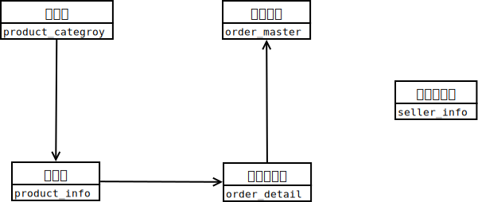

# SpringBoot 打造微信点餐系统

## 项目内容及总结

- [SpringBoot 打造微信点餐系统](#springboot-打造微信点餐系统)
    - [项目演示](#项目演示)
    - [项目架构](#项目架构)
    - [项目设计](#项目设计)
        - [api文档](#api文档)
        - [微信](#微信)
        - [角色划分](#角色划分)
        - [功能模块划分](#功能模块划分)
        - [部署架构](#部署架构)
        - [分布式系统](#分布式系统)
        - [MyBatis](#MyBatis)
        - [Redis](#Redis)
        - [数据库设计](#数据库设计)
    - [开发环境搭建](#开发环境搭建)
    - [日志](#日志)
    - [功能实现](#功能实现)
    - [项目已知问题](#项目已知问题)
    - [项目部署](#项目部署)

### *项目演示*

- 部分演示：

  - 卖家管理系统-订单列表

  

  - 卖家管理系统-商品列表

  
  
  - 卖家管理系统-添加商品

  
  
  - 卖家管理系统-分类列表
  
  
  
  - 卖家管理系统-添加分类
  
  
  
  - 卖家管理系统-新订单提示
  
    使用PostMan接口测试，模拟新建订单，后台管理WebSocket收到新订单，发送提示到页面上
  
  

### *项目架构*

1. 前端:
   - Vue
   - WebApp

2. 后端:
   - SpringBoot
   - Bootstrap + Freemarker + JQuery

3. 前后端连接:
   - RESTful

4. 数据库:
   - SpringBoot + JPA
   - SpringBoot + MyBatis

5. 缓存:
   - SpringBoot + Redis
      - Redis: 分布式 Session 和 分布式锁
      - 解决`超卖`

6. 消息推送:
   - WebSocket

7. 微信端:
   - 微信扫码登录
   - 消息模板推送
   - 微信支付和退款

### *项目设计*

#### api文档

[api文档](./docs/API.md)

#### [微信](./docs/WeChat.md)

1. 微信授权
2. 微信支付
3. 微信退款

#### 角色划分

1. 买家
2. 卖家

#### 功能模块划分

<div align=center></div>

#### 部署架构

微信前端和浏览器请求通过Nginx转发给Tomcat,如果需要缓存,就请求Redis, 否则就请求MySQL

#### 分布式系统

[分布式系统](./docs/分布式系统.md)

#### MyBatis

[MyBatis](./docs/MyBatis.md)

#### Redis

[Redis](./docs/Redis.md)

#### 数据库设计

1. 表之间的关系

<div align=center></div>

2. 具体表

|#|Table|
|:-|:-|
|商品分类表|product_category|
|商品表|product_info|
|订单详情表|order_detail|
|订单主表|order_master|
|卖家信息表|seller_info|

### *开发环境搭建*  

|#|Version|#|Version|
| :- | :- | :- | :- |
|SpringBoot|1.5.20|Linux|CentOS 7.3|
|Idea|2019.1.1|JDK|1.8.0_202|
|Maven|3.3.9|MySQL|5.7.25|
|||Nginx|1.11.7|
|||Redis|3.2.8|

### *日志*

[日志框架](./docs/logger.md)

### *功能实现*

1. 买家端
    - [x] 买家端类目
    - [x] 买家端商品
    - [x] 买家端订单

2. 卖家端
    - [x] 卖家端订单
    - [x] 卖家端通用功能和上下架
    - [x] 卖家端新增商品和类目

3. 微信端
    - [x] 微信公众平台注册问题，暂无法调用
    - [ ] 微信授权
    - [ ] 微信支付和退款

4. 买家和卖家端联通
    - [x] 分布式session
    - [x] 卖家信息表
    - [x] 登陆登出

5. 优化
    - [x] 异常捕获
    - [x] MyBatis
    - [x] 并发
    - [x] Redis

### *项目已知问题*

- 微信公众平台账号问题，待解决
- 域名转发写死，不能读取配置文件

### *项目部署*

- 项目打包

```shell
# 在项目根目录下，打开终端
mvn clean package -Dmaven.skip.test=true
# 在项目根目录下，多了一个target文件夹，里面有一个.jar后缀的包，这个就是打包文件
```

- 上传到服务器

```shell
# 把打包文件发送到服务器上/root/javaapps文件夹下
scp target/sell.jar root@<your ip>:/root/javaapps
```

- 服务器后台运行

```shell
# 编写一个sh命令脚本
#!bin/sh
nohup java -jar -Dspring.profiles.active=prod sell.jar > /dev/null 2>&1 &
# 保存，sh sell.sh运行即可
```

