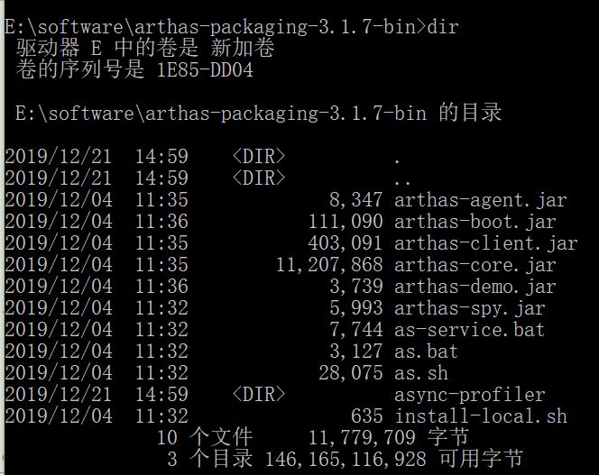
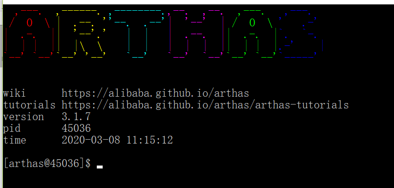

## 背景

在Java Web/Spring Boot开发时，很常见的问题是：

* 网页访问404了，为什么访问不到？
* 登陆失败了，请求返回401，到底是哪个Filter拦截了我的请求？

碰到这种问题时，通常很头痛，特别是在线上环境时。

本文介绍使用Alibaba开源的Java诊断利器Arthas，来快速定位这类Web请求404/401问题。

* https://github.com/alibaba/arthas

## Java Web里一个请求被处理的流程

在进入正题之前，先温习下知识。一个普通的Java Web请求处理流程大概是这样子的：

```
Request  -> Filter1 -> Filter2 ... -> Servlet
                                        |
Response <- Filter1 <- Filter2 ... <- Servlet
```

## Demo

本文的介绍基于一个很简单的Demo：https://github.com/hengyunabc/spring-boot-inside/tree/master/demo-404-401

* 访问 http://localhost:8080/ ，返回200，正常打印Welconme信息
* 访问 http://localhost:8080/a.txt ，返回404
* 访问 http://localhost:8080/admin ，返回401

## 是哪个Servlet返回了404？

Demo启动后，访问：http://localhost:8080/a.txt ，返回404：

```bash
$ curl http://localhost:8080/a.txt
{"timestamp":1546790485831,"status":404,"error":"Not Found","message":"No message available","path":"/a.txt"}
```

**我们知道一个HTTP Request，大部分情况下都是由一个Servlet处理的，那么到底是哪个Servlet返回了404？**

我们使用Arthas的`trace`命令来定位：
```bash
$ jps
101328 Jps
79588
99684 RemoteMavenServer
45036 Demo404401Application
```
查看arthas 目录


启动arthas
```bash
$ as.bat 45036
```
启动之后的效果图：


```bash
$ trace javax.servlet.Servlet *
Press Ctrl+C to abort.
Affect(class-cnt:7 , method-cnt:185) cost in 1018 ms.
```

然后访问 http://localhost:8080/a.txt ，Arthas会打印出整个请求树，完整的输出太长，这里只截取关键的一输出：
> 具体完整的日志可以参考(./docs/01.log)
```java
+---[13.087083ms] org.springframework.web.servlet.DispatcherServlet:resolveViewName()
|   `---[13.020984ms] org.springframework.web.servlet.DispatcherServlet:resolveViewName()
|       +---[0.002777ms] java.util.List:iterator()
|       +---[0.001955ms] java.util.Iterator:hasNext()
|       +---[0.001739ms] java.util.Iterator:next()
|       `---[12.891979ms] org.springframework.web.servlet.ViewResolver:resolveViewName()
|           +---[0.089811ms] javax.servlet.GenericServlet:<init>()
|           +---[min=0.037696ms,max=0.054478ms,total=0.092174ms,count=2] org.springframework.web.servlet.view.freemarker.FreeMarkerView$GenericServletAdapter:<init>()
```
如何保存arthas 日志信息
```bash
$ options
```


```bash
 options save-result true
```


可以看出请求经过Spring MVC的`DispatcherServlet`处理，最终由`ViewResolver`分派给`FreeMarkerView$GenericServletAdapter`处理。所以我们可以知道这个请求最终是被`FreeMarker`处理的。
后面再排查`FreeMarker`的配置就可以了。

这个神奇的`trace javax.servlet.Servlet *`到底是怎样工作的呢？

实际上Arthas会匹配到JVM里所有实现了`javax.servlet.Servlet`的类，然后`trace`它们的所有函数，所以HTTP请求会被打印出来。

> 这里留一个小问题，为什么只访问了`http://localhost:8080/a.txt`，但Arthas的`trace`命令打印出了两个请求树？

## 是哪个Filter返回了401？

在Demo里，访问 http://localhost:8080/admin ，会返回401，即没有权限。那么是哪个Filter拦截了请求？

```bash
$ curl http://localhost:8080/admin
{"timestamp":1546794743674,"status":401,"error":"Unauthorized","message":"admin filter error.","path":"/admin"}
```

我们还是使用Arthas的`trace`命令来定位，不过这次`trace`的是`javax.servlet.Filter`：

```bash
$ trace javax.servlet.Filter *
Press Ctrl+C to abort.
Affect(class-cnt:13 , method-cnt:75) cost in 278 ms.
```

再次访问admin，在Arthas里，把整个请求经过哪些Filter处理，都打印为树。这里截取关键部分：
> 全部日志在(./docs/02.log)
```java
+---[0.704625ms] org.springframework.web.filter.OncePerRequestFilter:doFilterInternal()
|   `---[0.60387ms] org.springframework.web.filter.RequestContextFilter:doFilterInternal()
|       +---[0.022704ms] org.springframework.web.context.request.ServletRequestAttributes:<init>()
|       +---[0.217636ms] org.springframework.web.filter.RequestContextFilter:initContextHolders()
|       |   `---[0.180323ms] org.springframework.web.filter.RequestContextFilter:initContextHolders()
|       |       +---[0.034656ms] javax.servlet.http.HttpServletRequest:getLocale()
|       |       +---[0.0311ms] org.springframework.context.i18n.LocaleContextHolder:setLocale()
|       |       +---[0.008691ms] org.springframework.web.context.request.RequestContextHolder:setRequestAttributes()
|       |       `---[0.014918ms] org.apache.commons.logging.Log:isDebugEnabled()
|       +---[0.215481ms] javax.servlet.FilterChain:doFilter()
|       |   `---[0.072186ms] com.example.demo404401.AdminFilterConfig$AdminFilter:doFilter()
|       |       `---[0.021945ms] javax.servlet.http.HttpServletResponse:sendError()
```

可以看到HTTP Request最终是被`com.example.demo404401.AdminFilterConfig$AdminFilter`处理的。


## 总结

* 通过trace Servlet/Filter，可以快速定位Java Web问题
* trace是了解应用执行流程的利器，只要trace到关键的接口或者类上
* 仔细观察trace的结果，可以学习到Spring MVC是处理Web请求细节

## 链接

* https://github.com/alibaba/arthas
* https://alibaba.github.io/arthas/trace.html

打个广告，Arthas正在征集使用者，您的使用是对我们最大的支持。
如果Arthas对您排找问题有帮助，请到这里来登记下，并在30分钟内成为Arthas Contributor：

https://github.com/alibaba/arthas/issues/395 
