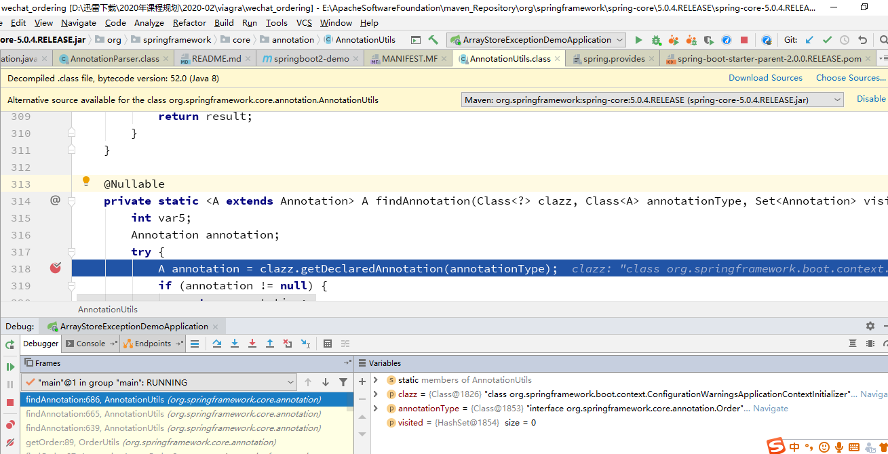

## java.lang.ArrayStoreException 分析[这个例子无法复现]

demo里有两个模块，`springboot1-starter`和`springboot2-demo`。


在`springboot1-starter`模块里，是一个简单的`HealthIndicator`实现

```java
public class MyHealthIndicator extends AbstractHealthIndicator {
	@Override
	protected void doHealthCheck(Builder builder) throws Exception {
		builder.status(Status.UP);
		builder.withDetail("hello", "world");
	}
}
```

```java
@Configuration
@AutoConfigureBefore(EndpointAutoConfiguration.class)
@AutoConfigureAfter(HealthIndicatorAutoConfiguration.class)
@ConditionalOnClass(value = { HealthIndicator.class })
public class MyHealthIndicatorAutoConfiguration {
	@Bean
	@ConditionalOnMissingBean(MyHealthIndicator.class)
	@ConditionalOnEnabledHealthIndicator("my")
	public MyHealthIndicator myHealthIndicator() {
		return new MyHealthIndicator();
	}
}
```

`springboot2-demo`则是一个简单的spring boot2应用，引用了`springboot1-starter`模块。


把工程导入IDE，执行`springboot2-demo`里的`ArrayStoreExceptionDemoApplication`，抛出的异常是

```
Caused by: java.lang.ArrayStoreException: sun.reflect.annotation.TypeNotPresentExceptionProxy
	at sun.reflect.annotation.AnnotationParser.parseClassArray(AnnotationParser.java:724) ~[na:1.8.0_112]
	at sun.reflect.annotation.AnnotationParser.parseArray(AnnotationParser.java:531) ~[na:1.8.0_112]
	at sun.reflect.annotation.AnnotationParser.parseMemberValue(AnnotationParser.java:355) ~[na:1.8.0_112]
	at sun.reflect.annotation.AnnotationParser.parseAnnotation2(AnnotationParser.java:286) ~[na:1.8.0_112]
	at sun.reflect.annotation.AnnotationParser.parseAnnotations2(AnnotationParser.java:120) ~[na:1.8.0_112]
	at sun.reflect.annotation.AnnotationParser.parseAnnotations(AnnotationParser.java:72) ~[na:1.8.0_112]
	at java.lang.Class.createAnnotationData(Class.java:3521) ~[na:1.8.0_112]
	at java.lang.Class.annotationData(Class.java:3510) ~[na:1.8.0_112]
	at java.lang.Class.createAnnotationData(Class.java:3526) ~[na:1.8.0_112]
	at java.lang.Class.annotationData(Class.java:3510) ~[na:1.8.0_112]
	at java.lang.Class.getAnnotation(Class.java:3415) ~[na:1.8.0_112]
	at java.lang.reflect.AnnotatedElement.isAnnotationPresent(AnnotatedElement.java:258) ~[na:1.8.0_112]
	at java.lang.Class.isAnnotationPresent(Class.java:3425) ~[na:1.8.0_112]
	at org.springframework.core.annotation.AnnotatedElementUtils.hasAnnotation(AnnotatedElementUtils.java:575) ~[spring-core-5.0.4.RELEASE.jar:5.0.4.RELEASE]
	at org.springframework.web.servlet.mvc.method.annotation.RequestMappingHandlerMapping.isHandler(RequestMappingHandlerMapping.java:177) ~[spring-webmvc-5.0.4.RELEASE.jar:5.0.4.RELEASE]
	at org.springframework.web.servlet.handler.AbstractHandlerMethodMapping.initHandlerMethods(AbstractHandlerMethodMapping.java:217) ~[spring-webmvc-5.0.4.RELEASE.jar:5.0.4.RELEASE]
	at org.springframework.web.servlet.handler.AbstractHandlerMethodMapping.afterPropertiesSet(AbstractHandlerMethodMapping.java:188) ~[spring-webmvc-5.0.4.RELEASE.jar:5.0.4.RELEASE]
	at org.springframework.web.servlet.mvc.method.annotation.RequestMappingHandlerMapping.afterPropertiesSet(RequestMappingHandlerMapping.java:129) ~[spring-webmvc-5.0.4.RELEASE.jar:5.0.4.RELEASE]
	at org.springframework.beans.factory.support.AbstractAutowireCapableBeanFactory.invokeInitMethods(AbstractAutowireCapableBeanFactory.java:1769) ~[spring-beans-5.0.4.RELEASE.jar:5.0.4.RELEASE]
	at org.springframework.beans.factory.support.AbstractAutowireCapableBeanFactory.initializeBean(AbstractAutowireCapableBeanFactory.java:1706) ~[spring-beans-5.0.4.RELEASE.jar:5.0.4.RELEASE]
	... 16 common frames omitted
```


## 使用 Java Exception Breakpoint

下面来排查这个问题。

在IDE里，新建一个断点，类型是`Java Exception Breakpoint`（如果不清楚怎么添加，可以搜索对应IDE的使用文档），异常类是上面抛出来的`java.lang.ArrayStoreException`。

查看一下thread dump:
```xml
"localhost-startStop-1@4937" daemon prio=5 tid=0x23 nid=NA runnable
  java.lang.Thread.State: RUNNABLE
	  at sun.reflect.annotation.AnnotationParser.parseClassArray(AnnotationParser.java:724)
	  at sun.reflect.annotation.AnnotationParser.parseArray(AnnotationParser.java:531)
	  at sun.reflect.annotation.AnnotationParser.parseMemberValue(AnnotationParser.java:355)
	  at sun.reflect.annotation.AnnotationParser.parseAnnotation2(AnnotationParser.java:286)
	  at sun.reflect.annotation.AnnotationParser.parseAnnotations2(AnnotationParser.java:120)
	  at sun.reflect.annotation.AnnotationParser.parseAnnotations(AnnotationParser.java:72)
	  at java.lang.Class.createAnnotationData(Class.java:3521)
	  at java.lang.Class.annotationData(Class.java:3510)
	  at java.lang.Class.createAnnotationData(Class.java:3526)
	  at java.lang.Class.annotationData(Class.java:3510)
	  at java.lang.Class.getDeclaredAnnotation(Class.java:3458)
	  at org.springframework.core.annotation.AnnotationUtils.findAnnotation(AnnotationUtils.java:686)
	  at org.springframework.core.annotation.AnnotationUtils.findAnnotation(AnnotationUtils.java:665)
	  at org.springframework.core.annotation.AnnotationUtils.findAnnotation(AnnotationUtils.java:639)
	  at org.springframework.beans.factory.support.DefaultListableBeanFactory.findAnnotationOnBean(DefaultListableBeanFactory.java:581)
	  at org.springframework.beans.factory.support.DefaultListableBeanFactory.getBeanNamesForAnnotation(DefaultListableBeanFactory.java:545)
	  at org.springframework.context.support.AbstractApplicationContext.getBeanNamesForAnnotation(AbstractApplicationContext.java:1208)
	  at org.springframework.beans.factory.BeanFactoryUtils.beanNamesForAnnotationIncludingAncestors(BeanFactoryUtils.java:369)
	  at org.springframework.boot.actuate.endpoint.annotation.EndpointDiscoverer.createEndpointBeans(EndpointDiscoverer.java:129)
	  at org.springframework.boot.actuate.endpoint.annotation.EndpointDiscoverer.discoverEndpoints(EndpointDiscoverer.java:122)
	  at org.springframework.boot.actuate.endpoint.annotation.EndpointDiscoverer.getEndpoints(EndpointDiscoverer.java:116)
	  at org.springframework.boot.actuate.autoconfigure.endpoint.web.ServletEndpointManagementContextConfiguration.servletEndpointRegistrar(ServletEndpointManagementContextConfiguration.java:46)
	  at org.springframework.boot.actuate.autoconfigure.endpoint.web.ServletEndpointManagementContextConfiguration$$EnhancerBySpringCGLIB$$9f0df310.CGLIB$servletEndpointRegistrar$1(<generated>:-1)
	  at org.springframework.boot.actuate.autoconfigure.endpoint.web.ServletEndpointManagementContextConfiguration$$EnhancerBySpringCGLIB$$9f0df310$$FastClassBySpringCGLIB$$6a8ecc2a.invoke(<generated>:-1)
	  at org.springframework.cglib.proxy.MethodProxy.invokeSuper(MethodProxy.java:228)
	  at org.springframework.context.annotation.ConfigurationClassEnhancer$BeanMethodInterceptor.intercept(ConfigurationClassEnhancer.java:361)
	  at org.springframework.boot.actuate.autoconfigure.endpoint.web.ServletEndpointManagementContextConfiguration$$EnhancerBySpringCGLIB$$9f0df310.servletEndpointRegistrar(<generated>:-1)
	  at sun.reflect.NativeMethodAccessorImpl.invoke0(NativeMethodAccessorImpl.java:-1)
	  at sun.reflect.NativeMethodAccessorImpl.invoke(NativeMethodAccessorImpl.java:62)
	  at sun.reflect.DelegatingMethodAccessorImpl.invoke(DelegatingMethodAccessorImpl.java:43)
	  at java.lang.reflect.Method.invoke(Method.java:498)
	  at org.springframework.beans.factory.support.SimpleInstantiationStrategy.instantiate(SimpleInstantiationStrategy.java:154)
	  at org.springframework.beans.factory.support.ConstructorResolver.instantiateUsingFactoryMethod(ConstructorResolver.java:579)
	  at org.springframework.beans.factory.support.AbstractAutowireCapableBeanFactory.instantiateUsingFactoryMethod(AbstractAutowireCapableBeanFactory.java:1250)
	  at org.springframework.beans.factory.support.AbstractAutowireCapableBeanFactory.createBeanInstance(AbstractAutowireCapableBeanFactory.java:1099)
	  at org.springframework.beans.factory.support.AbstractAutowireCapableBeanFactory.doCreateBean(AbstractAutowireCapableBeanFactory.java:545)
	  at org.springframework.beans.factory.support.AbstractAutowireCapableBeanFactory.createBean(AbstractAutowireCapableBeanFactory.java:502)
	  at org.springframework.beans.factory.support.AbstractBeanFactory.lambda$doGetBean$0(AbstractBeanFactory.java:312)
	  at org.springframework.beans.factory.support.AbstractBeanFactory$$Lambda$88.840514538.getObject(Unknown Source:-1)
	  at org.springframework.beans.factory.support.DefaultSingletonBeanRegistry.getSingleton(DefaultSingletonBeanRegistry.java:228)
	  - locked <0x1549> (a java.util.concurrent.ConcurrentHashMap)
	  at org.springframework.beans.factory.support.AbstractBeanFactory.doGetBean(AbstractBeanFactory.java:310)
	  at org.springframework.beans.factory.support.AbstractBeanFactory.getBean(AbstractBeanFactory.java:205)
	  at org.springframework.boot.web.servlet.ServletContextInitializerBeans.getOrderedBeansOfType(ServletContextInitializerBeans.java:226)
	  at org.springframework.boot.web.servlet.ServletContextInitializerBeans.getOrderedBeansOfType(ServletContextInitializerBeans.java:214)
	  at org.springframework.boot.web.servlet.ServletContextInitializerBeans.addServletContextInitializerBeans(ServletContextInitializerBeans.java:91)
	  at org.springframework.boot.web.servlet.ServletContextInitializerBeans.<init>(ServletContextInitializerBeans.java:79)
	  at org.springframework.boot.web.servlet.context.ServletWebServerApplicationContext.getServletContextInitializerBeans(ServletWebServerApplicationContext.java:250)
	  at org.springframework.boot.web.servlet.context.ServletWebServerApplicationContext.selfInitialize(ServletWebServerApplicationContext.java:237)
	  at org.springframework.boot.web.servlet.context.ServletWebServerApplicationContext$$Lambda$226.1163404461.onStartup(Unknown Source:-1)
	  at org.springframework.boot.web.embedded.tomcat.TomcatStarter.onStartup(TomcatStarter.java:54)
	  at org.apache.catalina.core.StandardContext.startInternal(StandardContext.java:5204)
	  - locked <0x14cc> (a org.springframework.boot.web.embedded.tomcat.TomcatEmbeddedContext)
	  at org.apache.catalina.util.LifecycleBase.start(LifecycleBase.java:150)
	  at org.apache.catalina.core.ContainerBase$StartChild.call(ContainerBase.java:1419)
	  at org.apache.catalina.core.ContainerBase$StartChild.call(ContainerBase.java:1409)
	  at java.util.concurrent.FutureTask.run$$$capture(FutureTask.java:266)
	  at java.util.concurrent.FutureTask.run(FutureTask.java:-1)
	  at java.util.concurrent.ThreadPoolExecutor.runWorker(ThreadPoolExecutor.java:1142)
	  at java.util.concurrent.ThreadPoolExecutor$Worker.run(ThreadPoolExecutor.java:617)
	  at java.lang.Thread.run(Thread.java:745)
```


当断点起效时，查看`AnnotationUtils.findAnnotation(Class<?>, Class<A>, Set<Annotation>) line: 686` 函数的参数。
> spring boot 2.0.0.RELEASE版本是基于spring 5.0封装的

可以发现

* clazz是 `org.springframework.boot.context.ConfigurationWarningsApplicationContextInitializer`
* annotationType是 `org.springframework.core.annotation.Order`


说明是尝试从`MyHealthIndicatorAutoConfiguration`里查找`@Order`信息时出错的。

`MyHealthIndicatorAutoConfiguration`上的确没有`@Order`，**但是为什么抛出`java.lang.ArrayStoreException`?**

## 尝试以简单例子复现异常

首先尝试直接 new MyHealthIndicatorAutoConfiguration ：
```java
	public static void main(String[] args) {
		MyHealthIndicatorAutoConfiguration cc = new MyHealthIndicatorAutoConfiguration();
	}
```

本以为会抛出异常来，但是发现执行正常。

再仔细看异常栈，可以发现是在`at java.lang.Class.getDeclaredAnnotation(Class.java:3458)`抛出的异常，则再尝试下面的代码：

```java
	public static void main(String[] args) {
		MyHealthIndicatorAutoConfiguration.class.getDeclaredAnnotation(Endpoint.class);
	}
```

发现可以复现异常了：

```
Exception in thread "main" java.lang.ArrayStoreException: sun.reflect.annotation.TypeNotPresentExceptionProxy
	at sun.reflect.annotation.AnnotationParser.parseClassArray(AnnotationParser.java:724)
	at sun.reflect.annotation.AnnotationParser.parseArray(AnnotationParser.java:531)
	at sun.reflect.annotation.AnnotationParser.parseMemberValue(AnnotationParser.java:355)
	at sun.reflect.annotation.AnnotationParser.parseAnnotation2(AnnotationParser.java:286)
	at sun.reflect.annotation.AnnotationParser.parseAnnotations2(AnnotationParser.java:120)
	at sun.reflect.annotation.AnnotationParser.parseAnnotations(AnnotationParser.java:72)
	at java.lang.Class.createAnnotationData(Class.java:3521)
	at java.lang.Class.annotationData(Class.java:3510)
	at java.lang.Class.getDeclaredAnnotation(Class.java:3458)
```

## 为什么会是java.lang.ArrayStoreException

再仔细看异常信息：java.lang.ArrayStoreException: sun.reflect.annotation.TypeNotPresentExceptionProxy

`ArrayStoreException`是一个数组越界的异常，它只有一个String信息，并没有`cause`。

那么我们尝试在 `sun.reflect.annotation.TypeNotPresentExceptionProxy` 的构造函数里打断点。


```java
public class TypeNotPresentExceptionProxy extends ExceptionProxy {
    private static final long serialVersionUID = 5565925172427947573L;
    String typeName;
    Throwable cause;

    public TypeNotPresentExceptionProxy(String typeName, Throwable cause) {
        this.typeName = typeName;
        this.cause = cause;
    }
```

在断点里，我们可以发现：

* typeName是 `org.springframework.boot.actuate.autoconfigure.EndpointAutoConfiguration`
* cause是 `java.lang.ClassNotFoundException: org.springframework.boot.actuate.autoconfigure.EndpointAutoConfiguration`

终于真相大白了，是找不到`org.springframework.boot.actuate.autoconfigure.EndpointAutoConfiguration`这个类。

那么它是怎么变成`ArrayStoreException`的呢？

仔细看下代码，可以发现`AnnotationParser.parseClassValue`把异常包装成为`Object`

```java
//sun.reflect.annotation.AnnotationParser.parseClassValue(ByteBuffer, ConstantPool, Class<?>)
    private static Object parseClassValue(ByteBuffer buf,
                                          ConstantPool constPool,
                                          Class<?> container) {
        int classIndex = buf.getShort() & 0xFFFF;
        try {
            try {
                String sig = constPool.getUTF8At(classIndex);
                return parseSig(sig, container);
            } catch (IllegalArgumentException ex) {
                // support obsolete early jsr175 format class files
                return constPool.getClassAt(classIndex);
            }
        } catch (NoClassDefFoundError e) {
            return new TypeNotPresentExceptionProxy("[unknown]", e);
        }
        catch (TypeNotPresentException e) {
            return new TypeNotPresentExceptionProxy(e.typeName(), e.getCause());
        }
    }
```

然后在`sun.reflect.annotation.AnnotationParser.parseClassArray(int, ByteBuffer, ConstantPool, Class<?>)`里尝试直接设置到数组里

```java
// sun.reflect.annotation.AnnotationParser.parseClassArray(int, ByteBuffer, ConstantPool, Class<?>)
result[i] = parseClassValue(buf, constPool, container);
```

而这里数组越界了，`ArrayStoreException`只有越界的`Object`的类型信息，也就是上面的

```
java.lang.ArrayStoreException: sun.reflect.annotation.TypeNotPresentExceptionProxy
```


## 解决问题

发现是`java.lang.ClassNotFoundException: org.springframework.boot.actuate.autoconfigure.EndpointAutoConfiguration`，则加上`@ConditionalOnClass`的检查就可以了：

```java
@Configuration
@AutoConfigureBefore(EndpointAutoConfiguration.class)
@AutoConfigureAfter(HealthIndicatorAutoConfiguration.class)
@ConditionalOnClass(value = {HealthIndicator.class, EndpointAutoConfiguration.class})
public class MyHealthIndicatorAutoConfiguration {
```

准确来说是spring boot2把一些类的package改了：

spring boot 1里类名是：

* org.springframework.boot.actuate.autoconfigure.EndpointAutoConfiguration

spring boot 2里类名是：

* org.springframework.boot.actuate.autoconfigure.endpoint.EndpointAutoConfiguration


## 总结

* 当类加载时，并不会加载它的annotation的field所引用的`Class<?>`，当调用`Class.getDeclaredAnnotation(Class<A>)`里才会加载

    以上面的例子来说，就是`@AutoConfigureBefore(EndpointAutoConfiguration.class)`里的`EndpointAutoConfiguration`并不会和`MyHealthIndicatorAutoConfiguration`一起被加载。

* jdk内部的解析字节码的代码不合理，把`ClassNotFoundException`异常吃掉了
* 排查问题需要一步步深入调试
