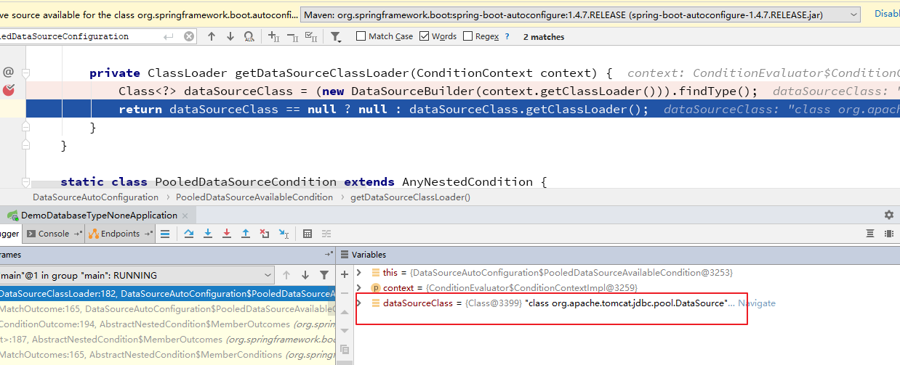

## 写在前面

这个demo来说明怎么一步步排查一个常见的spring boot AutoConfiguration的错误。

## 调试排查 Cannot determine embedded database driver class for database type NONE 的错误

把工程导入IDE里，直接启动应用，抛出来的异常信息是：

```

Error starting ApplicationContext. To display the auto-configuration report re-run your application with 'debug' enabled.
2017-11-29 14:26:34.478 ERROR 29736 --- [           main] o.s.b.d.LoggingFailureAnalysisReporter   :

***************************
APPLICATION FAILED TO START
***************************

Description:

Cannot determine embedded database driver class for database type NONE

Action:

If you want an embedded database please put a supported one on the classpath. If you have database settings to be loaded from a particular profile you may need to active it (no profiles are currently active).


```

其实这时有两个思路，直接google搜索`Cannot determine embedded database driver class for database type NONE`，就可以找到解决办法。

第二种方式，仔细查看日志内容，可以发现有`To display the auto-configuration report re-run your application with 'debug' enabled.`。

搜索下这个，就可以在spring的官方网站上找到相关的信息：https://docs.spring.io/spring-boot/docs/current/reference/html/using-boot-auto-configuration.html

就是用户只要配置了`debug`这个开关，就会把`auto-configuration` 相关的信息打印出来。

熟悉spring的环境变量注入的话，就可以知道有几种打开这个的方式：

* 在`args`里增加`--debug`
* 在application.properties里增加`debug=true`
* 通过`-Ddebug=true`

## 增加`debug`开关之后的信息

增加`debug`开关之后，可以看到打印出了错误堆栈：

```
2017-11-29 14:33:08.776 DEBUG 29907 --- [           main] o.s.b.d.LoggingFailureAnalysisReporter   : Application failed to start due to an exception

org.springframework.boot.autoconfigure.jdbc.DataSourceProperties$DataSourceBeanCreationException: Cannot determine embedded database driver class for database type NONE. If you want an embedded database please put a supported one on the classpath. If you have database settings to be loaded from a particular profile you may need to active it (no profiles are currently active).
	at org.springframework.boot.autoconfigure.jdbc.DataSourceProperties.determineDriverClassName(DataSourceProperties.java:245) ~[spring-boot-autoconfigure-1.4.7.RELEASE.jar:1.4.7.RELEASE]
	at org.springframework.boot.autoconfigure.jdbc.DataSourceProperties.initializeDataSourceBuilder(DataSourceProperties.java:182) ~[spring-boot-autoconfigure-1.4.7.RELEASE.jar:1.4.7.RELEASE]
	at org.springframework.boot.autoconfigure.jdbc.DataSourceConfiguration.createDataSource(DataSourceConfiguration.java:42) ~[spring-boot-autoconfigure-1.4.7.RELEASE.jar:1.4.7.RELEASE]
	at org.springframework.boot.autoconfigure.jdbc.DataSourceConfiguration$Tomcat.dataSource(DataSourceConfiguration.java:53) ~[spring-boot-autoconfigure-1.4.7.RELEASE.jar:1.4.7.RELEASE]
	at sun.reflect.NativeMethodAccessorImpl.invoke0(Native Method) ~[na:1.8.0_112]
```

抛出异常的代码是：

```java
	/**
	 * Determine the driver to use based on this configuration and the environment.
	 * @return the driver to use
	 * @since 1.4.0
	 */
	public String determineDriverClassName() {
		if (StringUtils.hasText(this.driverClassName)) {
			Assert.state(driverClassIsLoadable(),
					"Cannot load driver class: " + this.driverClassName);
			return this.driverClassName;
		}
		String driverClassName = null;

		if (StringUtils.hasText(this.url)) {
			driverClassName = DatabaseDriver.fromJdbcUrl(this.url).getDriverClassName();
		}

		if (!StringUtils.hasText(driverClassName)) {
			driverClassName = this.embeddedDatabaseConnection.getDriverClassName();
		}

		if (!StringUtils.hasText(driverClassName)) {
			throw new DataSourceBeanCreationException(this.embeddedDatabaseConnection,
					this.environment, "driver class");
		}
		return driverClassName;
	}
```

可以看出来是没有找到 DataSource 的driver class，然后抛出了 `DataSourceBeanCreationException`。

那么一种解决办法是，在maven依赖里加入一些 DataSource driver class。

但是应用自己的代码里并没有使用DataSource，哪里导致spring boot要创建一个DataSource对象？

## 哪里导致spring boot要创建DataSource

从异常栈上，可以找到`DataSourceConfiguration$Tomcat` 这个类，那么查找下它的引用，可以发现它是被`org.springframework.boot.autoconfigure.jdbc.DataSourceAutoConfiguration.PooledDataSourceConfiguration` import引入的。

```java
	@Configuration
	@Conditional(PooledDataSourceCondition.class)
	@ConditionalOnMissingBean({ DataSource.class, XADataSource.class })
	@Import({ DataSourceConfiguration.Tomcat.class, DataSourceConfiguration.Hikari.class,
			DataSourceConfiguration.Dbcp.class, DataSourceConfiguration.Dbcp2.class,
			DataSourceConfiguration.Generic.class })
	protected static class PooledDataSourceConfiguration {

	}
```

那么 `PooledDataSourceConfiguration` 是怎么生效的呢？从代码上可以看到`@Conditional(PooledDataSourceCondition.class)`。

那么再看`PooledDataSourceCondition`的具体实现：

```java
	/**
	 * {@link AnyNestedCondition} that checks that either {@code spring.datasource.type}
	 * is set or {@link PooledDataSourceAvailableCondition} applies.
	 */
	static class PooledDataSourceCondition extends AnyNestedCondition {

		PooledDataSourceCondition() {
			super(ConfigurationPhase.PARSE_CONFIGURATION);
		}

		@ConditionalOnProperty(prefix = "spring.datasource", name = "type")
		static class ExplicitType {

		}

		@Conditional(PooledDataSourceAvailableCondition.class)
		static class PooledDataSourceAvailable {

		}

	}
```

`PooledDataSourceCondition`引入了`@Conditional(PooledDataSourceAvailableCondition.class)` ：

```java
	/**
	 * {@link Condition} to test if a supported connection pool is available.
	 */
	static class PooledDataSourceAvailableCondition extends SpringBootCondition {

		@Override
		public ConditionOutcome getMatchOutcome(ConditionContext context,
				AnnotatedTypeMetadata metadata) {
			ConditionMessage.Builder message = ConditionMessage
					.forCondition("PooledDataSource");
			if (getDataSourceClassLoader(context) != null) {
				return ConditionOutcome
						.match(message.foundExactly("supported DataSource"));
			}
			return ConditionOutcome
					.noMatch(message.didNotFind("supported DataSource").atAll());
		}

		/**
		 * Returns the class loader for the {@link DataSource} class. Used to ensure that
		 * the driver class can actually be loaded by the data source.
		 * @param context the condition context
		 * @return the class loader
		 */
		private ClassLoader getDataSourceClassLoader(ConditionContext context) {
			Class<?> dataSourceClass = new DataSourceBuilder(context.getClassLoader())
					.findType();
			return (dataSourceClass == null ? null : dataSourceClass.getClassLoader());
		}

	}
```

从代码里，可以看到是尝试查找`dataSourceClass`，如果找到，条件就成立。那么debug下，可以发现查找到的`dataSourceClass`是：`org.apache.tomcat.jdbc.pool.DataSource` 。


那么再看下`org.apache.tomcat.jdbc.pool.DataSource`这个类是从哪里来的呢？位于`org.apache.tomcat:tomcat-jdbc:jar:8.5.15` jar里面
```sql
mvn dependency:tree
```
结果如下：
```yaml
[INFO]
[INFO] ------------------------------------------------------------------------
[INFO] Building demo-database-type-NONE 0.0.1-SNAPSHOT
[INFO] ------------------------------------------------------------------------
[INFO]
[INFO] --- maven-dependency-plugin:2.10:tree (default-cli) @ demo-database-type-NONE ---
[INFO] com.example:demo-database-type-NONE:jar:0.0.1-SNAPSHOT
[INFO] +- org.springframework.boot:spring-boot-starter:jar:1.4.7.RELEASE:compile
[INFO] |  +- org.springframework.boot:spring-boot:jar:1.4.7.RELEASE:compile
[INFO] |  +- org.springframework.boot:spring-boot-autoconfigure:jar:1.4.7.RELEASE:compile
[INFO] |  +- org.springframework.boot:spring-boot-starter-logging:jar:1.4.7.RELEASE:compile
[INFO] |  |  +- ch.qos.logback:logback-classic:jar:1.1.11:compile
[INFO] |  |  |  \- ch.qos.logback:logback-core:jar:1.1.11:compile
[INFO] |  |  +- org.slf4j:jcl-over-slf4j:jar:1.7.25:compile
[INFO] |  |  +- org.slf4j:jul-to-slf4j:jar:1.7.25:compile
[INFO] |  |  \- org.slf4j:log4j-over-slf4j:jar:1.7.25:compile
[INFO] |  +- org.springframework:spring-core:jar:4.3.9.RELEASE:compile
[INFO] |  \- org.yaml:snakeyaml:jar:1.17:runtime
[INFO] +- org.springframework.boot:spring-boot-starter-web:jar:1.4.7.RELEASE:compile
[INFO] |  +- org.springframework.boot:spring-boot-starter-tomcat:jar:1.4.7.RELEASE:compile
[INFO] |  |  +- org.apache.tomcat.embed:tomcat-embed-core:jar:8.5.15:compile
[INFO] |  |  +- org.apache.tomcat.embed:tomcat-embed-el:jar:8.5.15:compile
[INFO] |  |  \- org.apache.tomcat.embed:tomcat-embed-websocket:jar:8.5.15:compile
[INFO] |  +- org.hibernate:hibernate-validator:jar:5.2.5.Final:compile
[INFO] |  |  +- javax.validation:validation-api:jar:1.1.0.Final:compile
[INFO] |  |  +- org.jboss.logging:jboss-logging:jar:3.3.1.Final:compile
[INFO] |  |  \- com.fasterxml:classmate:jar:1.3.3:compile
[INFO] |  +- com.fasterxml.jackson.core:jackson-databind:jar:2.8.8:compile
[INFO] |  |  +- com.fasterxml.jackson.core:jackson-annotations:jar:2.8.8:compile
[INFO] |  |  \- com.fasterxml.jackson.core:jackson-core:jar:2.8.8:compile
[INFO] |  +- org.springframework:spring-web:jar:4.3.9.RELEASE:compile
[INFO] |  |  +- org.springframework:spring-aop:jar:4.3.9.RELEASE:compile
[INFO] |  |  \- org.springframework:spring-beans:jar:4.3.9.RELEASE:compile
[INFO] |  \- org.springframework:spring-webmvc:jar:4.3.9.RELEASE:compile
[INFO] |     \- org.springframework:spring-expression:jar:4.3.9.RELEASE:compile
[INFO] +- org.springframework.boot:spring-boot-starter-jdbc:jar:1.4.7.RELEASE:compile
[INFO] |  +- org.apache.tomcat:tomcat-jdbc:jar:8.5.15:compile
[INFO] |  |  \- org.apache.tomcat:tomcat-juli:jar:8.5.15:compile
[INFO] |  \- org.springframework:spring-jdbc:jar:4.3.9.RELEASE:compile
[INFO] |     \- org.springframework:spring-tx:jar:4.3.9.RELEASE:compile
[INFO] +- org.springframework.boot:spring-boot-actuator:jar:1.4.7.RELEASE:compile
[INFO] |  \- org.springframework:spring-context:jar:4.3.9.RELEASE:compile
[INFO] \- org.springframework.boot:spring-boot-starter-test:jar:1.4.7.RELEASE:test
[INFO]    +- org.springframework.boot:spring-boot-test:jar:1.4.7.RELEASE:test
[INFO]    +- org.springframework.boot:spring-boot-test-autoconfigure:jar:1.4.7.RELEASE:test
[INFO]    +- com.jayway.jsonpath:json-path:jar:2.2.0:test
[INFO]    |  +- net.minidev:json-smart:jar:2.2.1:test
[INFO]    |  |  \- net.minidev:accessors-smart:jar:1.1:test
[INFO]    |  |     \- org.ow2.asm:asm:jar:5.0.3:test
[INFO]    |  \- org.slf4j:slf4j-api:jar:1.7.25:compile
[INFO]    +- junit:junit:jar:4.12:test
[INFO]    +- org.assertj:assertj-core:jar:2.5.0:test
[INFO]    +- org.mockito:mockito-core:jar:1.10.19:test
[INFO]    |  \- org.objenesis:objenesis:jar:2.1:test
[INFO]    +- org.hamcrest:hamcrest-core:jar:1.3:test
[INFO]    +- org.hamcrest:hamcrest-library:jar:1.3:test
[INFO]    +- org.skyscreamer:jsonassert:jar:1.3.0:test
[INFO]    |  \- org.json:json:jar:20140107:test
[INFO]    \- org.springframework:spring-test:jar:4.3.9.RELEASE:test
[INFO] ------------------------------------------------------------------------
[INFO] BUILD SUCCESS
[INFO] ------------------------------------------------------------------------
[INFO] Total time: 22.118 s
[INFO] Finished at: 2020-03-06T09:39:09+08:00
[INFO] Final Memory: 23M/226M
[INFO] ------------------------------------------------------------------------
```

从maven依赖树可以看到，依赖是来自：`spring-boot-starter-jdbc`。所以是应用依赖了`spring-boot-starter-jdbc`，但是并没有配置`DataSource`引起的问题。

## 问题解决办法

有两种：

1. 没有使用到`DataSource`，则可以把`spring-boot-starter-jdbc`的依赖去掉，这样就不会触发spring boot相关的代码
2. 把spring boot自动初始化`DataSource`相关的代码禁止掉


禁止的办法有两种：

1. 在main函数上配置exclude

      ```
          @SpringBootApplication(exclude = { DataSourceAutoConfiguration.class, DataSourceTransactionManagerAutoConfiguration.class })
      ```
2. 在application.properties里配置：

      ```
          spring.autoconfigure.exclude=org.springframework.boot.autoconfigure.jdbc.DataSourceAutoConfiguration,org.springframework.boot.autoconfigure.jdbc.DataSourceTransactionManagerAutoConfiguration
      ```

## 总结


0. 应用没有使用到`DataSource`，但是在pom.xml里引入了`spring-boot-starter-jdbc`
0. `spring-boot-starter-jdbc`带入了`tomcat-jdbc`，它里面有`org.apache.tomcat.jdbc.pool.DataSource`
0. spring boot里的`PooledDataSourceConfiguration`，判断classpath下面有`DataSource`的实现类，尝试去创建`DataSource` bean
0. 在初始化`DataSourceProperties`时，尝试通过jdbc的url来探测driver class
0. 因为应用并没有配置url，所以最终在`DataSourceProperties.determineDriverClassName()`里抛出`Cannot determine embedded database driver class for database type NONE`

最后：

* 排查spring boot的AutoConfiguration问题时，可以按异常栈，一层层排查`Configuration`是怎么引入的，再排查`Condition`具体的判断代码。
