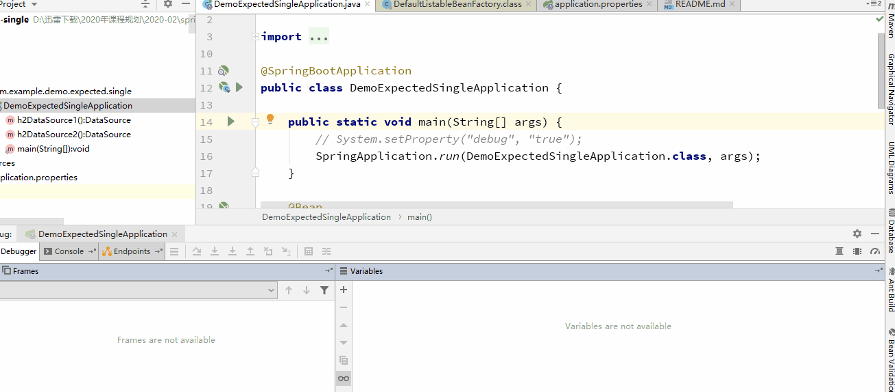
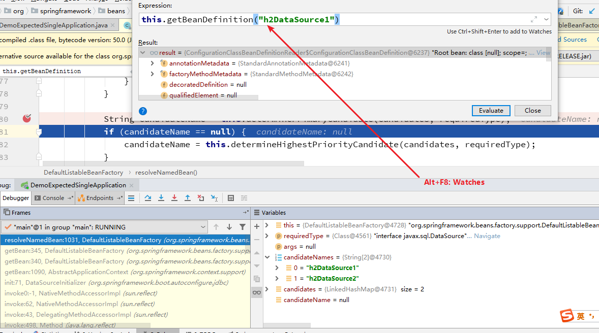

## 写在前面

这个demo来说明怎么排查一个常见的spring expected single matching bean but found 2的异常。

## 调试排查 expected single matching bean but found 2 的错误

把工程导入IDE里，直接启动应用，抛出来的异常信息是：

```
Caused by: org.springframework.beans.factory.NoUniqueBeanDefinitionException: No qualifying bean of type 'javax.sql.DataSource' available: expected single matching bean but found 2: h2DataSource1,h2DataSource2
	at org.springframework.beans.factory.support.DefaultListableBeanFactory.resolveNamedBean(DefaultListableBeanFactory.java:1041) ~[spring-beans-4.3.9.RELEASE.jar:4.3.9.RELEASE]
	at org.springframework.beans.factory.support.DefaultListableBeanFactory.getBean(DefaultListableBeanFactory.java:345) ~[spring-beans-4.3.9.RELEASE.jar:4.3.9.RELEASE]
	at org.springframework.beans.factory.support.DefaultListableBeanFactory.getBean(DefaultListableBeanFactory.java:340) ~[spring-beans-4.3.9.RELEASE.jar:4.3.9.RELEASE]
	at org.springframework.context.support.AbstractApplicationContext.getBean(AbstractApplicationContext.java:1090) ~[spring-context-4.3.9.RELEASE.jar:4.3.9.RELEASE]
	at org.springframework.boot.autoconfigure.jdbc.DataSourceInitializer.init(DataSourceInitializer.java:71) ~[spring-boot-autoconfigure-1.4.7.RELEASE.jar:1.4.7.RELEASE]
	at sun.reflect.NativeMethodAccessorImpl.invoke0(Native Method) ~[na:1.8.0_112]
	at sun.reflect.NativeMethodAccessorImpl.invoke(NativeMethodAccessorImpl.java:62) ~[na:1.8.0_112]
	at sun.reflect.DelegatingMethodAccessorImpl.invoke(DelegatingMethodAccessorImpl.java:43) ~[na:1.8.0_112]
	at java.lang.reflect.Method.invoke(Method.java:498) ~[na:1.8.0_112]
	at org.springframework.beans.factory.annotation.InitDestroyAnnotationBeanPostProcessor$LifecycleElement.invoke(InitDestroyAnnotationBeanPostProcessor.java:366) ~[spring-beans-4.3.9.RELEASE.jar:4.3.9.RELEASE]
	at org.springframework.beans.factory.annotation.InitDestroyAnnotationBeanPostProcessor$LifecycleMetadata.invokeInitMethods(InitDestroyAnnotationBeanPostProcessor.java:311) ~[spring-beans-4.3.9.RELEASE.jar:4.3.9.RELEASE]
	at org.springframework.beans.factory.annotation.InitDestroyAnnotationBeanPostProcessor.postProcessBeforeInitialization(InitDestroyAnnotationBeanPostProcessor.java:134) ~[spring-beans-4.3.9.RELEASE.jar:4.3.9.RELEASE]
	... 30 common frames omitted
```


很多人碰到这种错误时，就乱配置一通，找不到下手的办法。其实耐心排查下，是很简单的。

## 抛出异常的原因

异常信息写得很清楚了，在spring context里需要注入/获取到一个`DataSource`  bean，但是现在spring context里出现了两个，它们的名字是：h2DataSource1,h2DataSource2

那么有两个问题：

1. 应用是在哪里要注入/获取到一个`DataSource`  bean？
1. h2DataSource1,h2DataSource2 是在哪里定义的？

## 使用 Java Exception Breakpoint

在IDE里，新建一个断点，类型是`Java Exception Breakpoint`（如果不清楚怎么添加，可以搜索对应IDE的使用文档，可以查看如下图），异常类是上面抛出来的`NoUniqueBeanDefinitionException`。


当断点停住时，查看栈，可以很清楚地找到是在`DataSourceInitializer.init() line: 71	`这里要获取`DataSource`：


```
"main@1" prio=5 tid=0x1 nid=NA runnable
  java.lang.Thread.State: RUNNABLE
	  at org.springframework.beans.factory.support.DefaultListableBeanFactory.resolveNamedBean(DefaultListableBeanFactory.java:1041)
	  at org.springframework.beans.factory.support.DefaultListableBeanFactory.getBean(DefaultListableBeanFactory.java:345)
	  at org.springframework.beans.factory.support.DefaultListableBeanFactory.getBean(DefaultListableBeanFactory.java:340)
	  at org.springframework.context.support.AbstractApplicationContext.getBean(AbstractApplicationContext.java:1090)
	  at org.springframework.boot.autoconfigure.jdbc.DataSourceInitializer.init(DataSourceInitializer.java:71)
	  at sun.reflect.NativeMethodAccessorImpl.invoke0(NativeMethodAccessorImpl.java:-1)
	  at sun.reflect.NativeMethodAccessorImpl.invoke(NativeMethodAccessorImpl.java:62)
	  at sun.reflect.DelegatingMethodAccessorImpl.invoke(DelegatingMethodAccessorImpl.java:43)
	  at java.lang.reflect.Method.invoke(Method.java:498)
	  at org.springframework.beans.factory.annotation.InitDestroyAnnotationBeanPostProcessor$LifecycleElement.invoke(InitDestroyAnnotationBeanPostProcessor.java:366)
	  at org.springframework.beans.factory.annotation.InitDestroyAnnotationBeanPostProcessor$LifecycleMetadata.invokeInitMethods(InitDestroyAnnotationBeanPostProcessor.java:311)
	  at org.springframework.beans.factory.annotation.InitDestroyAnnotationBeanPostProcessor.postProcessBeforeInitialization(InitDestroyAnnotationBeanPostProcessor.java:134)
	  at org.springframework.beans.factory.support.AbstractAutowireCapableBeanFactory.applyBeanPostProcessorsBeforeInitialization(AbstractAutowireCapableBeanFactory.java:409)
	  at org.springframework.beans.factory.support.AbstractAutowireCapableBeanFactory.initializeBean(AbstractAutowireCapableBeanFactory.java:1620)
	  at org.springframework.beans.factory.support.AbstractAutowireCapableBeanFactory.doCreateBean(AbstractAutowireCapableBeanFactory.java:555)
	  at org.springframework.beans.factory.support.AbstractAutowireCapableBeanFactory.createBean(AbstractAutowireCapableBeanFactory.java:483)
	  at org.springframework.beans.factory.support.AbstractBeanFactory$1.getObject(AbstractBeanFactory.java:306)
	  at org.springframework.beans.factory.support.DefaultSingletonBeanRegistry.getSingleton(DefaultSingletonBeanRegistry.java:230)
	  - locked <0x12aa> (a java.util.concurrent.ConcurrentHashMap)
	  at org.springframework.beans.factory.support.AbstractBeanFactory.doGetBean(AbstractBeanFactory.java:302)
	  at org.springframework.beans.factory.support.AbstractBeanFactory.getBean(AbstractBeanFactory.java:220)
	  at org.springframework.beans.factory.support.DefaultListableBeanFactory.resolveNamedBean(DefaultListableBeanFactory.java:1018)
	  at org.springframework.beans.factory.support.DefaultListableBeanFactory.getBean(DefaultListableBeanFactory.java:345)
	  at org.springframework.beans.factory.support.DefaultListableBeanFactory.getBean(DefaultListableBeanFactory.java:340)
	  at org.springframework.boot.autoconfigure.jdbc.DataSourceInitializerPostProcessor.postProcessAfterInitialization(DataSourceInitializerPostProcessor.java:62)
	  at org.springframework.beans.factory.support.AbstractAutowireCapableBeanFactory.applyBeanPostProcessorsAfterInitialization(AbstractAutowireCapableBeanFactory.java:423)
	  at org.springframework.beans.factory.support.AbstractAutowireCapableBeanFactory.initializeBean(AbstractAutowireCapableBeanFactory.java:1633)
	  at org.springframework.beans.factory.support.AbstractAutowireCapableBeanFactory.doCreateBean(AbstractAutowireCapableBeanFactory.java:555)
	  at org.springframework.beans.factory.support.AbstractAutowireCapableBeanFactory.createBean(AbstractAutowireCapableBeanFactory.java:483)
	  at org.springframework.beans.factory.support.AbstractBeanFactory$1.getObject(AbstractBeanFactory.java:306)
	  at org.springframework.beans.factory.support.DefaultSingletonBeanRegistry.getSingleton(DefaultSingletonBeanRegistry.java:230)
	  at org.springframework.beans.factory.support.AbstractBeanFactory.doGetBean(AbstractBeanFactory.java:302)
	  at org.springframework.beans.factory.support.AbstractBeanFactory.getBean(AbstractBeanFactory.java:197)
	  at org.springframework.beans.factory.support.DefaultListableBeanFactory.preInstantiateSingletons(DefaultListableBeanFactory.java:761)
	  at org.springframework.context.support.AbstractApplicationContext.finishBeanFactoryInitialization(AbstractApplicationContext.java:867)
	  at org.springframework.context.support.AbstractApplicationContext.refresh(AbstractApplicationContext.java:543)
	  - locked <0x12d8> (a java.lang.Object)
	  at org.springframework.boot.context.embedded.EmbeddedWebApplicationContext.refresh(EmbeddedWebApplicationContext.java:122)
	  at org.springframework.boot.SpringApplication.refresh(SpringApplication.java:762)
	  at org.springframework.boot.SpringApplication.refreshContext(SpringApplication.java:372)
	  at org.springframework.boot.SpringApplication.run(SpringApplication.java:316)
	  at org.springframework.boot.SpringApplication.run(SpringApplication.java:1187)
	  at org.springframework.boot.SpringApplication.run(SpringApplication.java:1176)
	  at com.example.demo.expected.single.DemoExpectedSingleApplication.main(DemoExpectedSingleApplication.java:16)
```

### 定位哪里要注入/使用`DataSource`

要获取`DataSource`具体的代码是：

```java
//org.springframework.boot.autoconfigure.jdbc.DataSourceInitializer.init()
	@PostConstruct
	public void init() {
		if (!this.properties.isInitialize()) {
			logger.debug("Initialization disabled (not running DDL scripts)");
			return;
		}
		if (this.applicationContext.getBeanNamesForType(DataSource.class, false,
				false).length > 0) {
			this.dataSource = this.applicationContext.getBean(DataSource.class);
		}
		if (this.dataSource == null) {
			logger.debug("No DataSource found so not initializing");
			return;
		}
		runSchemaScripts();
	}
```

`this.applicationContext.getBean(DataSource.class);` 要求spring context里只有一个`DataSource`的bean，但是应用里有两个，所以抛出了`NoUniqueBeanDefinitionException`。


### 从`BeanDefinition`获取bean具体定义的代码

我们再来看 h2DataSource1,h2DataSource2 是在哪里定义的？

上面进程断在了`DefaultListableBeanFactory.resolveNamedBean(Class<T>, Object...)` 函数里的 `throw new NoUniqueBeanDefinitionException(requiredType, candidates.keySet());` 这一行。

那么我们在这里执行一下（如果不清楚，先搜索下IDE怎么在断点情况下执行代码）：


```java
this.getBeanDefinition("h2DataSource1")
```

返回的信息是：

```
Root bean: class [null]; scope=; abstract=false; lazyInit=false; autowireMode=3; dependencyCheck=0; autowireCandidate=true; primary=false; factoryBeanName=demoExpectedSingleApplication; factoryMethodName=h2DataSource1; initMethodName=null; destroyMethodName=(inferred);
defined in com.example.demo.expected.single.DemoExpectedSingleApplication
```

可以很清楚地定位到`h2DataSource1`这个bean是在 `com.example.demo.expected.single.DemoExpectedSingleApplication`里定义的。

所以上面两个问题的答案是：

1. 是spring boot代码里的`DataSourceInitializer.init() line: 71	`这里要获取`DataSource`，并且只允许有一个`DataSource`实例
2. h2DataSource1,h2DataSource2 是在`com.example.demo.expected.single.DemoExpectedSingleApplication`里定义的

## 解决问题

上面排查到的原因是：应用定义了两个`DataSource`实例，但是spring boot却要求只有一个。那么有两种办法来解决：

1. 使用`@Primary`来指定一个优先使用的`DataSource`，这样子spring boot里自动初始的代码会获取到`@Primary`的bean
2. 把spring boot自动初始化`DataSource`相关的代码禁止掉，应用自己来控制所有的`DataSource`相关的bean


禁止的办法有两种：

1. 在main函数上配置exclude

      ```
          @SpringBootApplication(exclude = { DataSourceAutoConfiguration.class, DataSourceTransactionManagerAutoConfiguration.class })
      ```
2. 在application.properties里配置：

      ```
          spring.autoconfigure.exclude=org.springframework.boot.autoconfigure.jdbc.DataSourceAutoConfiguration,org.springframework.boot.autoconfigure.jdbc.DataSourceTransactionManagerAutoConfiguration
      ```

## 总结

* 排查spring初始化问题时，灵活使用Java Exception Breakpoint
* 从异常栈上，可以很容易找到哪里要注入/使用bean
* 从`BeanDefinition`可以找到bean是在哪里定义的（哪个Configuration类/xml）

