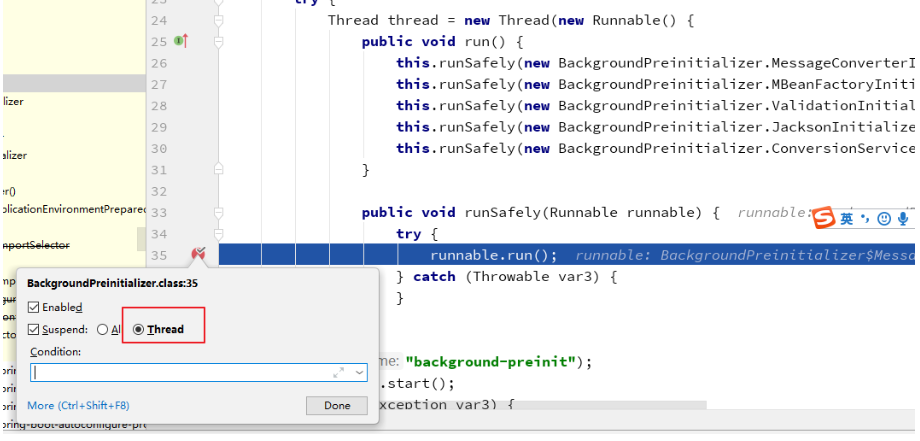
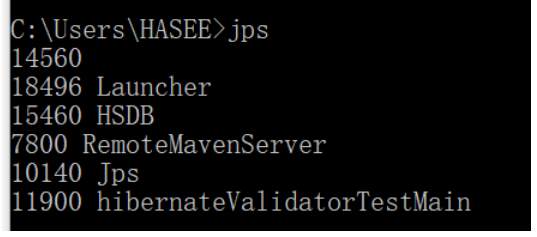

# 深入JVM分析spring-boot应用hibernate-validator NoClassDefFoundError

## 问题

- 项目名称：demo-hibernate-validator-NoClassDefFoundError

最近排查一个spring boot应用抛出hibernate.validator NoClassDefFoundError的问题，异常信息如下：

```verilog
Caused by: java.lang.NoClassDefFoundError: Could not initialize class org.hibernate.validator.internal.engine.ConfigurationImpl
	at org.hibernate.validator.HibernateValidator.createGenericConfiguration(HibernateValidator.java:33) ~[hibernate-validator-5.3.5.Final.jar:5.3.5.Final]
	at javax.validation.Validation$GenericBootstrapImpl.configure(Validation.java:276) ~[validation-api-1.1.0.Final.jar:na]
	at org.springframework.boot.validation.MessageInterpolatorFactory.getObject(MessageInterpolatorFactory.java:53) ~[spring-boot-1.5.3.RELEASE.jar:1.5.3.RELEASE]
	at org.springframework.boot.autoconfigure.validation.DefaultValidatorConfiguration.defaultValidator(DefaultValidatorConfiguration.java:43) ~[spring-boot-autoconfigure-1.5.3.RELEASE.jar:1.5.3.RELEASE]
	at sun.reflect.NativeMethodAccessorImpl.invoke0(Native Method) ~[na:1.8.0_101]
	at sun.reflect.NativeMethodAccessorImpl.invoke(NativeMethodAccessorImpl.java:62) ~[na:1.8.0_101]
	at sun.reflect.DelegatingMethodAccessorImpl.invoke(DelegatingMethodAccessorImpl.java:43) ~[na:1.8.0_101]
	at java.lang.reflect.Method.invoke(Method.java:498) ~[na:1.8.0_101]
	at org.springframework.beans.factory.support.SimpleInstantiationStrategy.instantiate(SimpleInstantiationStrategy.java:162) ~[spring-beans-4.3.8.RELEASE.jar:4.3.8.RELEASE]
	... 32 common frames omitted
```

这个错误信息表面上是*NoClassDefFoundError*，但是实际上*ConfigurationImpl*这个类是在**hibernate-validator-5.3.5.Final.jar**里的，不应该出现找不到类的情况。

那为什么应用里抛出这个*NoClassDefFoundError* ？

有经验的开发人员从*Could not initialize class* 这个信息就可以知道，实际上是一个类在初始化时抛出的异常，比如static的静态代码块，或者static字段初始化的异常。

## 谁初始化了 org.hibernate.validator.internal.engine.ConfigurationImpl

但是当我们在`HibernateValidator` 这个类，创建`ConfigurationImpl`的代码块里打断点时，发现有两个线程触发了断点：

```java
public class HibernateValidator implements ValidationProvider<HibernateValidatorConfiguration> {
	//...
	@Override
	public Configuration<?> createGenericConfiguration(BootstrapState state) {
		return new ConfigurationImpl( state );
	}
}
```

其中一个线程的调用栈是：

```yml
"main@1" prio=5 tid=0x1 nid=NA runnable
  java.lang.Thread.State: RUNNABLE
	  at java.lang.ClassLoader.findLoadedClass0(ClassLoader.java:-1)
	  at java.lang.ClassLoader.findLoadedClass(ClassLoader.java:1038)
	  at java.lang.ClassLoader.loadClass(ClassLoader.java:406)
	  - locked <0x881> (a java.lang.Object)
	  at java.lang.ClassLoader.loadClass(ClassLoader.java:411)
	  - locked <0x882> (a java.lang.Object)
	  at sun.misc.Launcher$AppClassLoader.loadClass(Launcher.java:331)
	  at java.lang.ClassLoader.loadClass(ClassLoader.java:357)
	  at org.springframework.boot.SpringBootBanner.printBanner(SpringBootBanner.java:49)
	  at org.springframework.boot.SpringApplicationBannerPrinter.print(SpringApplicationBannerPrinter.java:71)
	  at org.springframework.boot.SpringApplication.printBanner(SpringApplication.java:549)
	  at org.springframework.boot.SpringApplication.run(SpringApplication.java:309)
	  at org.springframework.boot.SpringApplication.run(SpringApplication.java:1162)
	  at org.springframework.boot.SpringApplication.run(SpringApplication.java:1151)
	  at com.example.DemoApplication.main(DemoApplication.java:13)
	
```

另外一个线程调用栈是：

```yaml
"background-preinit@2151" prio=5 tid=0x17 nid=NA runnable
  java.lang.Thread.State: RUNNABLE
	  at org.springframework.boot.autoconfigure.BackgroundPreinitializer$ValidationInitializer.run(BackgroundPreinitializer.java:107)
	  at org.springframework.boot.autoconfigure.BackgroundPreinitializer$1.runSafely(BackgroundPreinitializer.java:59)
	  at org.springframework.boot.autoconfigure.BackgroundPreinitializer$1.run(BackgroundPreinitializer.java:52)
	  at java.lang.Thread.run(Thread.java:745)

```

显然，这个线程的调用栈是常见的spring的初始化过程。

### BackgroundPreinitializer 做了什么

那么重点来看下 `BackgroundPreinitializer` 线程做了哪些事情：

```java
@Order(LoggingApplicationListener.DEFAULT_ORDER + 1)
public class BackgroundPreinitializer
		implements ApplicationListener<ApplicationEnvironmentPreparedEvent> {

	@Override
	public void onApplicationEvent(ApplicationEnvironmentPreparedEvent event) {
		try {
			Thread thread = new Thread(new Runnable() {

				@Override
				public void run() {
					runSafely(new MessageConverterInitializer());
					runSafely(new MBeanFactoryInitializer());
					runSafely(new ValidationInitializer());
					runSafely(new JacksonInitializer());
					runSafely(new ConversionServiceInitializer());
				}

				public void runSafely(Runnable runnable) {
					try {
						runnable.run();
					}
					catch (Throwable ex) {
						// Ignore
					}
				}

			}, "background-preinit");
			thread.start();
		}
    }
```

可以看到**BackgroundPreinitializer**类是spring boot为了加速应用的初始化，以一个独立的线程来加载**hibernate validator**这些组件。

这个 **background-preinit** 线程会吞掉所有的异常。

显然ConfigurationImpl 初始化的异常也被吞掉了，那么如何才能获取到最原始的信息？

### 获取到最原始的异常信息

在BackgroundPreinitializer的 run() 函数里打一个断点（注意是Suspend thread类型, 不是Suspend VM），让它先不要触发ConfigurationImpl的加载，让spring boot的正常流程去触发ConfigurationImpl的加载，就可以知道具体的信息了。

```java
# org.springframework.boot.autoconfigure.BackgroundPreinitializer
@Order(-2147483627)
public class BackgroundPreinitializer implements ApplicationListener<ApplicationEnvironmentPreparedEvent> {
    public BackgroundPreinitializer() {
    }

    public void onApplicationEvent(ApplicationEnvironmentPreparedEvent event) {
        try {
            Thread thread = new Thread(new Runnable() {
                public void run() {
                    this.runSafely(new BackgroundPreinitializer.MessageConverterInitializer());
                    this.runSafely(new BackgroundPreinitializer.MBeanFactoryInitializer());
                    this.runSafely(new BackgroundPreinitializer.ValidationInitializer());
                    this.runSafely(new BackgroundPreinitializer.JacksonInitializer());
                    this.runSafely(new BackgroundPreinitializer.ConversionServiceInitializer());
                }

                public void runSafely(Runnable runnable) {
                    try {
                        runnable.run();
                    } catch (Throwable var3) {
                    }

                }
            }, "background-preinit");
            thread.start();
        } catch (Exception var3) {
        }

    }

    //...
}

```

> 在第20行打上断点：如下图；
>
> 

那么打出来的异常信息是：

```yaml
Caused by: java.lang.NoSuchMethodError: org.jboss.logging.Logger.getMessageLogger(Ljava/lang/Class;Ljava/lang/String;)Ljava/lang/Object;
	at org.hibernate.validator.internal.util.logging.LoggerFactory.make(LoggerFactory.java:19) ~[hibernate-validator-5.3.5.Final.jar:5.3.5.Final]
	at org.hibernate.validator.internal.util.Version.<clinit>(Version.java:22) ~[hibernate-validator-5.3.5.Final.jar:5.3.5.Final]
	at org.hibernate.validator.internal.engine.ConfigurationImpl.<clinit>(ConfigurationImpl.java:71) ~[hibernate-validator-5.3.5.Final.jar:5.3.5.Final]
	at org.hibernate.validator.HibernateValidator.createGenericConfiguration(HibernateValidator.java:33) ~[hibernate-validator-5.3.5.Final.jar:5.3.5.Final]
	at javax.validation.Validation$GenericBootstrapImpl.configure(Validation.java:276) ~[validation-api-1.1.0.Final.jar:na]
	at org.springframework.boot.validation.MessageInterpolatorFactory.getObject(MessageInterpolatorFactory.java:53) ~[spring-boot-1.5.3.RELEASE.jar:1.5.3.RELEASE]
	at org.springframework.boot.autoconfigure.validation.DefaultValidatorConfiguration.defaultValidator(DefaultValidatorConfiguration.java:43) ~[spring-boot-autoconfigure-1.5.3.RELEASE.jar:1.5.3.RELEASE]
	at sun.reflect.NativeMethodAccessorImpl.invoke0(Native Method) ~[na:1.8.0_101]
	at sun.reflect.NativeMethodAccessorImpl.invoke(NativeMethodAccessorImpl.java:62) ~[na:1.8.0_101]
	at sun.reflect.DelegatingMethodAccessorImpl.invoke(DelegatingMethodAccessorImpl.java:43) ~[na:1.8.0_101]
	at java.lang.reflect.Method.invoke(Method.java:498) ~[na:1.8.0_101]
	at org.springframework.beans.factory.support.SimpleInstantiationStrategy.instantiate(SimpleInstantiationStrategy.java:162) ~[spring-beans-4.3.8.RELEASE.jar:4.3.8.RELEASE]
	... 32 common frames omitted
```

那么可以看出是`org.jboss.logging.Logger` 这个类不兼容，少了`getMessageLogger(Ljava/lang/Class;Ljava/lang/String;)Ljava/lang/Object` 这个函数。

那么检查下应用的依赖，可以发现`org.jboss.logging.Logger` 在`jboss-common-1.2.1.GA.jar`和`jboss-logging-3.3.1.Final.jar`里都有。

显然是`jboss-common-1.2.1.GA.jar `这个依赖过时了，需要排除掉。

总结异常的发生流程

- 应用依赖了jboss-common-1.2.1.GA.jar，它里面的org.jboss.logging.Logger太老

- spring boot启动时，BackgroundPreinitializer里的线程去尝试加载ConfigurationImpl，然后触发了org.jboss.logging.Logger的函数执行问题

- BackgroundPreinitializer 吃掉了异常信息，jvm把ConfigurationImpl标记为不可用的

- spring boot正常的流程去加载ConfigurationImpl，jvm发现ConfigurationImpl类是不可用，直接抛出NoClassDefFoundError

```yaml
Caused by: java.lang.NoClassDefFoundError: Could not initialize class org.hibernate.validator.internal.engine.ConfigurationImpl
```

## 深入JVM

为什么第二次尝试加载`ConfigurationImpl`时，会直接抛出`java.lang.NoClassDefFoundError: Could not initialize class` ？

下面用一段简单的代码来重现这个问题：

```java
try {
  org.hibernate.validator.internal.util.Version.touch();
} catch (Throwable e) {
  e.printStackTrace();
}
System.in.read();

try {
  org.hibernate.validator.internal.util.Version.touch();
} catch (Throwable e) {
  e.printStackTrace();
}

```

### 使用HSDB来确定类的状态(在win10环境)

使用jps 命令来查找java进程id

```shell
jps
```




当抛出第一个异常时，尝试用HSDB来看下这个类的状态。

```shell
# 在控制台输入
java -classpath "%JAVA_HOME%/lib/sa-jdi.jar" sun.jvm.hotspot.HSDB
```

出现如下界面：


输入对应的线程id：


点击“ok”，会有如下显示：


选择tools》Class Browser，输入类`org.hibernate.validator.internal.util.Version;`


```shell
Create .class for this class
public final class org.hibernate.validator.internal.util.Version @0x00000007c0060a18
```

`class org.hibernate.validator.internal.util.Version`类的地址为`0x00000007c0060a18`

点击Tools》Inspector，输入这个地址：


再看下hotspot代码，可以发现5对应的定义是`initialization_error`：

> 最近想看看JDK8源码，但JDK中JVM（安装在本地C:\Program Files\Java\jdk1.8.0_121\jre\bin\server下jvm.dll）本身并不开源，只能找来openJDK来看（说是和JDK相似度很高）。源码包下载飞机票：http://download.java.net/openjdk/jdk8 （有时会坏，附上百度网盘https://pan.baidu.com/s/1o8bXbPC） 下载openjdk-8-src-b132-03_mar_2014.zip
> 下载完后发现目录结构很多，大体如下：
>
> ### 一、openjdk源码的目录结构
>
> 
>
> openjdk
> —— corba：不流行的多语言、分布式通讯接口
> —— hotspot：Java 虚拟机
> —— jaxp：XML 处理
> —— jaxws：一组 XML web services 的 [Java ](http://lib.csdn.net/base/java)API
> —— jdk：java 开发工具包
> —— —— 针对[操作系统](http://lib.csdn.net/base/operatingsystem)的部分
> —— —— share：与平台无关的实现
> —— langtools：Java 语言工具
> —— nashorn：JVM 上的 [JavaScript](http://lib.csdn.net/base/javascript) 运行时
>
> 其中Hotspot就是我们要看的JVM包
>
> Hotspot：全称 Java HotSpot Performance Engine，是 Java 虚拟机的一个实现，包含了服务器版和桌面应用程序版。利用 JIT 及自适应优化技术（自动查找性能热点并进行动态优化）来提高性能。
>
> 使用 `java -version` 可以查看 Hotspot 的版本。
>
> 
>
> # 二、Hotspot的目录结构
>
> ```
> ├─agent                            Serviceability Agent的客户端实现
> ├─make                             用来build出HotSpot的各种配置文件
> ├─src                              HotSpot VM的源代码
> │  ├─cpu                            CPU相关代码（汇编器、模板解释器、ad文件、部分runtime函数在这里实现）
> │  ├─os                             操作系相关代码
> │  ├─os_cpu                         操作系统+CPU的组合相关的代码
> │  └─share                          平台无关的共通代码
> │      ├─tools                        工具
> │      │  ├─hsdis                      反汇编插件
> │      │  ├─IdealGraphVisualizer       将server编译器的中间代码可视化的工具
> │      │  ├─launcher                   启动程序“java”
> │      │  ├─LogCompilation             将-XX:+LogCompilation输出的日志（hotspot.log）整理成更容易阅读的格式的工具
> │      │  └─ProjectCreator             生成Visual Studio的project文件的工具
> │      └─vm                           HotSpot VM的核心代码
> │          ├─adlc                       平台描述文件（上面的cpu或os_cpu里的*.ad文件）的编译器
> │          ├─asm                        汇编器接口
> │          ├─c1                         client编译器（又称“C1”）
> │          ├─ci                         动态编译器的公共服务/从动态编译器到VM的接口
> │          ├─classfile                  类文件的处理（包括类加载和系统符号表等）
> │          ├─code                       动态生成的代码的管理
> │          ├─compiler                   从VM调用动态编译器的接口
> │          ├─gc_implementation          GC的实现
> │          │  ├─concurrentMarkSweep      Concurrent Mark Sweep GC的实现
> │          │  ├─g1                       Garbage-First GC的实现（不使用老的分代式GC框架）
> │          │  ├─parallelScavenge         ParallelScavenge GC的实现（server VM默认，不使用老的分代式GC框架）
> │          │  ├─parNew                   ParNew GC的实现
> │          │  └─shared                   GC的共通实现
> │          ├─gc_interface               GC的接口
> │          ├─interpreter                解释器，包括“模板解释器”（官方版在用）和“C++解释器”（官方版不在用）
> │          ├─libadt                     一些抽象数据结构
> │          ├─memory                     内存管理相关（老的分代式GC框架也在这里）
> │          ├─oops                       HotSpot VM的对象系统的实现
> │          ├─opto                       server编译器（又称“C2”或“Opto”）
> │          ├─prims                      HotSpot VM的对外接口，包括部分标准库的native部分和JVMTI实现
> │          ├─runtime                    运行时支持库（包括线程管理、编译器调度、锁、反射等）
> │          ├─services                   主要是用来支持JMX之类的管理功能的接口
> │          ├─shark                      基于LLVM的JIT编译器（官方版里没有使用）
> │          └─utilities                  一些基本的工具类
> └─test                             单元测试
> ```
>
> 再看下hotspot代码，可以发现5对应的定义是initialization_error：
>
> ```cpp
> // /hotspot/src/share/vm/oops/instanceKlass.hpp
> // See "The Java Virtual Machine Specification" section 2.16.2-5 for a detailed description
> // of the class loading & initialization procedure, and the use of the states.
> enum ClassState {
> allocated,                          // allocated (but not yet linked)
> loaded,                             // loaded and inserted in class hierarchy (but not linked yet)
> linked,                             // successfully linked/verified (but not initialized yet)
> being_initialized,                  // currently running class initializer
> fully_initialized,                  // initialized (successfull final state)
> initialization_error                // error happened during initialization
> };
> ```

JVM规范里关于Initialization的内容
http://docs.oracle.com/javase/specs/jvms/se7/html/jvms-5.html#jvms-5.5

从规范里可以看到初始一个类/接口有12步，比较重要的两步都用黑体标记出来了：

- If the Class object for C is in an erroneous state, then initialization is not possible. Release LC and throw a NoClassDefFoundError.
- Otherwise, the class or interface initialization method must have completed abruptly by throwing some exception E. If the class of E is not Error or one of its subclasses, then create a new instance of the class ExceptionInInitializerError with E as the argument, and use this object in place of E in the following step.

### 第一次尝试加载Version类时

当第一次尝试加载时，hotspot InterpreterRuntime在解析invokestatic指令时，尝试加载org.hibernate.validator.internal.util.Version类，InstanceKlass的_init_state先是标记为being_initialized，然后当加载失败时，被标记为initialization_error。

对应Initialization的11步。

```cpp
// hotspot/src/share/vm/oops/instanceKlass.cpp
// Step 10 and 11
Handle e(THREAD, PENDING_EXCEPTION);
CLEAR_PENDING_EXCEPTION;
// JVMTI has already reported the pending exception
// JVMTI internal flag reset is needed in order to report ExceptionInInitializerError
JvmtiExport::clear_detected_exception((JavaThread*)THREAD);
{
  EXCEPTION_MARK;
  this_oop->set_initialization_state_and_notify(initialization_error, THREAD);
  CLEAR_PENDING_EXCEPTION;   // ignore any exception thrown, class initialization error is thrown below
  // JVMTI has already reported the pending exception
  // JVMTI internal flag reset is needed in order to report ExceptionInInitializerError
  JvmtiExport::clear_detected_exception((JavaThread*)THREAD);
}
DTRACE_CLASSINIT_PROBE_WAIT(error, InstanceKlass::cast(this_oop()), -1,wait);
if (e->is_a(SystemDictionary::Error_klass())) {
  THROW_OOP(e());
} else {
  JavaCallArguments args(e);
  THROW_ARG(vmSymbols::java_lang_ExceptionInInitializerError(),
            vmSymbols::throwable_void_signature(),
            &args);
}
```

### 第二次尝试加载Version类时

当第二次尝试加载时，检查InstanceKlass的_init_state是initialization_error，则直接抛出NoClassDefFoundError: Could not initialize class.

对应Initialization的5步。

```cpp
// hotspot/src/share/vm/oops/instanceKlass.cpp
void InstanceKlass::initialize_impl(instanceKlassHandle this_oop, TRAPS) {
// ...
    // Step 5
    if (this_oop->is_in_error_state()) {
      DTRACE_CLASSINIT_PROBE_WAIT(erroneous, InstanceKlass::cast(this_oop()), -1,wait);
      ResourceMark rm(THREAD);
      const char* desc = "Could not initialize class ";
      const char* className = this_oop->external_name();
      size_t msglen = strlen(desc) + strlen(className) + 1;
      char* message = NEW_RESOURCE_ARRAY(char, msglen);
      if (NULL == message) {
        // Out of memory: can't create detailed error message
        THROW_MSG(vmSymbols::java_lang_NoClassDefFoundError(), className);
      } else {
        jio_snprintf(message, msglen, "%s%s", desc, className);
        THROW_MSG(vmSymbols::java_lang_NoClassDefFoundError(), message);
      }
    }
```

### 总结

spring boot在BackgroundPreinitializer类里用一个独立的线程来加载validator，并吃掉了原始异常
第一次加载失败的类，在jvm里会被标记为initialization_error，再次加载时会直接抛出NoClassDefFoundError: Could not initialize class
当在代码里吞掉异常时要谨慎，否则排查问题带来很大的困难
http://docs.oracle.com/javase/specs/jvms/se7/html/jvms-5.html#jvms-5.5

https://www.cnblogs.com/alinainai/p/11070923.html