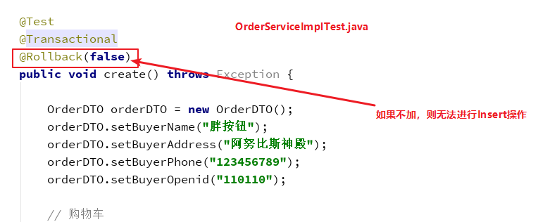

特点：
1. 主要是使用了websocket协议进行传输：WebSocket.java
2.功能如下：
### 商品列表


```shell  
-- 浏览器
GET http://localhost:8081/sell/buyer/product/list
```


```shell
-- 单元测试
POST http://localhost:8081/sell/buyer/order/create
```

3.收获的东西
1.spring boot 单元测试的几个问题：        
    1.`@Transactional` :
    目标方法和单元测试都加了`@Transactional` ：
    则必须在单元测试的方法上添加如下：
    
2.Spring 里`@Transactional`的使用：

参考： https://blog.csdn.net/acingdreamer/article/details/91873745
    